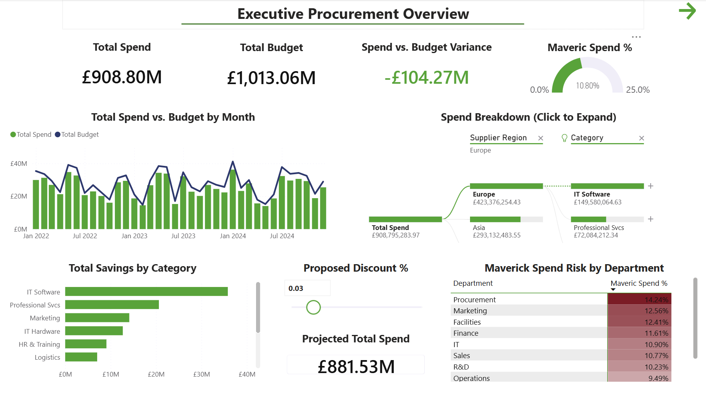
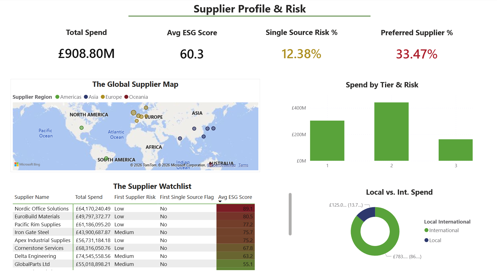
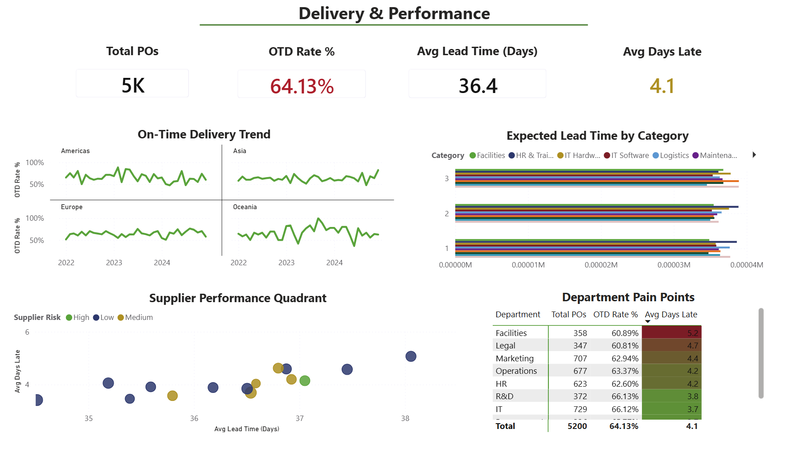
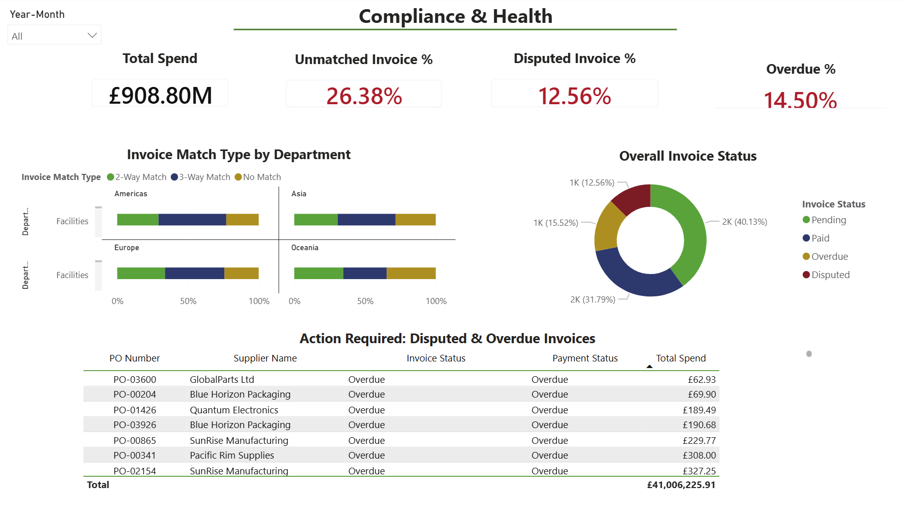

# 📦 Procurement Analytics Dashboard — Ironbridge Manufacturing Ltd.

**Ironbridge Manufacturing Ltd.** is a UK-based industrial manufacturing company with an international supply chain spanning Europe, Asia, the Americas, and Oceania. The business operates across multiple departments including Operations, R&D, Procurement, Sales, Marketing, Facilities, Finance, IT, Legal, HR & Training, and Logistics. With a total procurement spend of **£908.80M** across 2022–2024, managed through **5,200 purchase orders** and a global supplier base, the company has significant exposure to supplier risk, cost variance, and compliance challenges.

As a data analyst embedded within the procurement function and acting in an indirect buyer capacity, I was tasked with building a centralised analytics solution to replace fragmented, spreadsheet-based reporting. The goal was to give procurement leadership a clear, data-driven view of spend behaviour, supplier reliability, delivery performance, and invoice compliance.

Insights and recommendations are provided on the following key areas:

- **Spend Trends:** Monthly and category-level spend patterns across 2022–2024, including budget variance and savings performance
- **Supplier Performance:** Supplier concentration, ESG risk profiling, single-source exposure, and local vs. international split
- **Delivery & Lead Time:** On-time delivery rates, average lead times, and department-level pain points
- **Compliance & Invoice Health:** Maverick spend, invoice match rates, disputed invoices, and overdue payment exposure

> 📸 Screenshots of each dashboard page are embedded throughout this README. A short walkthrough video of the interactive dashboard can be viewed here: **[link]**

---

## Data Structure & Initial Checks

The dataset consists of a single flat table exported from the company's ERP system, containing **5,200 purchase order line records** spanning January 2022 to December 2024. A supporting supplier reference table was built manually for name standardisation purposes.

- **PO Transactions Table:** One row per PO line. Key fields include PO Number, PO Date, PO Year/Quarter/Month, PO Type, PO Status, Supplier ID, Supplier Name, Supplier Country, Supplier Region, Supplier Tier, Supplier Risk, Supplier ESG Score, Payment Terms, Item Code, Item Description, Category, Sub-Category, Unit of Measure, Unit Price, Quantity, Discount, Tax, Line Total, Currency, Budget Unit Price, Budget Total, Savings Amount, Requested Delivery, Actual Delivery, Days Late, On Time Delivery, Lead Time Days, Department, Cost Centre, Requestor, Approver, Contract ID, Contract Type, Contract Start/End, Invoice Status, Payment Status, Invoice Match Type, Maverick Spend Flag, Single Source Flag, Preferred Supplier Flag, and Local/International flag.

- **Supplier Reference Table:** A lookup table mapping supplier name variants to a single standardised supplier name, built in Power Query during the data preparation phase.

> 📸 *[Data model screenshot to be added here]*

---

## Executive Summary

### Overview of Findings

Ironbridge Manufacturing Ltd. spent **£908.80M** against a budget of **£1,013.06M** across 2022–2024, finishing **£104.27M under budget** — a strong headline result. However, underlying procurement health tells a more complex story: only **33.47%** of spend flows through preferred suppliers, on-time delivery stands at just **64.13%**, and **26.38%** of invoices are unmatched — all pointing to significant process and compliance gaps that are offsetting the budget savings achieved.

---

## Insights Deep Dive

### Spend Trends

- **Total spend of £908.80M came in £104.27M under the £1,013.06M budget**, representing a 10.3% underspend. This is a positive variance on paper, but the scale of the underspend warrants investigation — it may reflect deferred purchases, supplier delays, or budget over-allocation rather than genuine efficiency gains.

- **IT Software is the largest spend category**, dominating the savings league table with over £40M in savings achieved across the period. Professional Services is the second-largest savings contributor, suggesting the company has been active in renegotiating major contract categories.

- **Europe is the dominant supplier region**, accounting for £423.4M (46.6%) of total spend, followed by Asia at £293.1M (32.3%). This geographic concentration — particularly in Europe — creates macro-economic and supply chain risk that should be factored into category strategies.

- **Maverick spend sits at 10.80% overall**, with Procurement (14.24%) and Marketing (12.56%) as the worst-performing departments — notable given that Procurement, as a function, should be setting the standard for contract compliance rather than breaching it.

---

### Supplier Performance

- **Only 33.47% of spend goes through preferred suppliers**, meaning two-thirds of purchasing activity falls outside formally managed supplier relationships. This severely limits the company's ability to leverage volume pricing, enforce SLAs, and manage supply chain risk systematically.

- **Single-source risk affects 12.38% of spend** — purchases where there is only one identified supplier for a given item or category. This creates significant supply continuity risk, particularly for critical production inputs where no alternative vendor is pre-qualified.

- **The supplier base is heavily weighted toward international vendors**, with 86.3% of spend (£783M) going to international suppliers versus just 13.7% (£125M) to local UK suppliers. While this reflects the global nature of industrial supply chains, it increases exposure to currency fluctuation, logistics delays, and geopolitical risk.

- **Tier 2 suppliers account for the largest share of spend** across the three supplier tiers, with Tier 1 and Tier 3 receiving materially lower allocations. The average ESG score across the supplier base is **60.3 out of 100** — a moderate score that suggests room for improvement in supplier sustainability standards, particularly given increasing regulatory pressure on supply chain ESG disclosure.

---

### Delivery & Lead Time

- **On-time delivery (OTD) rate is 64.13% across 5,200 POs** — meaning over one in three orders arrives late. With an average of **4.1 days late** per delayed order and an average lead time of **36.4 days**, late deliveries are a persistent operational issue rather than an occasional exception.

- **OTD performance is consistently volatile across all four supplier regions** (Americas, Asia, Europe, Oceania), with no region achieving a stable upward trend across 2022–2024. This suggests the root cause is internal — in ordering practices, lead time planning, or SLA enforcement — rather than isolated to a specific geography.

- **Facilities (60.89%) and Legal (60.81%) are the worst-performing departments for on-time delivery**, while IT (66.12%) and R&D (66.13%) perform comparatively better. Given that Facilities manages physical site operations and Legal may be procuring time-sensitive services, both represent priority areas for lead time improvement.

- **Expected lead times vary significantly by category**, with some categories extending to 3x the lead time of others. Better category-level lead time visibility — surfaced through this dashboard — enables planners to build more realistic requisition timelines and reduce the frequency of expedited or emergency orders.

---

### Compliance & Invoice Health

- **26.38% of invoices are unmatched** — over 1 in 4 invoices cannot be automatically reconciled to a purchase order. This creates significant manual workload for the finance team and signals systemic weaknesses in PO discipline, goods receipt processes, or supplier invoicing practices.

- **12.56% of invoices are disputed** and **14.50% are overdue**, with total overdue invoice value reaching **£41,006,225.91**. The overdue balance represents real cash flow risk and potential damage to supplier relationships, particularly with key vendors such as GlobalParts Ltd, Blue Horizon Packaging, and SunRise Manufacturing — all of which appear in the overdue action list.

- **Invoice status is broadly split across four states**: Paid (40.13%), Pending (31.79%), Overdue (15.52%), and Disputed (12.56%). The fact that nearly 60% of invoices are not yet in a paid state at any given time indicates slow payment cycle throughput and potential bottlenecks in the approval or matching process.

- **Invoice match type varies significantly by department and region**, with a mix of 2-Way Match, 3-Way Match, and No Match across supplier regions. The prevalence of 2-Way Match and No Match cases in certain departments suggests inconsistent procurement controls and a lack of standardised purchasing procedure across the business.

---

## Recommendations

Based on the insights and findings above, we would recommend the procurement and finance leadership team at Ironbridge Manufacturing Ltd. to consider the following:

- Preferred supplier adoption sits at just 33.47%, meaning the majority of spend is unmanaged. **Introduce a mandatory preferred supplier policy with escalation controls for off-contract purchases, targeting 60%+ preferred supplier adoption within 12 months.**

- The Procurement department itself has the highest maverick spend rate at 14.24%. **Conduct an internal audit of Procurement team purchasing behaviour and use findings to reset compliance expectations — the function must model the standards it sets for the wider business.**

- Single-source risk at 12.38% leaves the business exposed to supply continuity failures. **Prioritise dual-sourcing strategies for the top 20 single-source items by spend value, beginning with critical Raw Materials and IT Software categories.**

- OTD of 64.13% means over one-third of orders arrive late, with Facilities and Legal departments most affected. **Implement category-level lead time standards within the ERP system and introduce supplier scorecards with quarterly OTD reviews for all Tier 1 and Tier 2 suppliers.**

- £41M in overdue invoices and a 26.38% unmatched invoice rate are creating cash flow risk and finance team burden. **Mandate 3-Way Match for all POs above £1,000 and introduce automated payment run scheduling to clear the overdue backlog within 90 days.**

---

## Assumptions and Caveats

Throughout the analysis, multiple assumptions were made to manage challenges with the data. These assumptions and caveats are noted below:

- **Missing Delivery Dates (~4% of records):** A subset of purchase orders had no delivery date recorded, identified as POs raised but never formally goods-receipted in the ERP. These records were excluded from all lead time and on-time delivery calculations and flagged separately in the Compliance & Health view as potentially unresolved orders.

- **Supplier Name Inconsistencies (~8% of records):** Several suppliers appeared under multiple name variants in the source data (e.g. "Grainger UK", "Grainger UK Ltd", "W.W. Grainger"). These were consolidated into standardised supplier names using a lookup table built in Power Query, matching on Supplier ID where available and manual review otherwise.

- **Contract Flag Gaps (~11% of records, predominantly 2022):** The contract flag column was unpopulated for a portion of records from 2022, the year before the company's preferred supplier list was formally documented. These records are classified as "Unclassified" in the maverick spend analysis and excluded from the maverick spend rate calculation to avoid distorting the metric.

- **Invoice Date Anomalies (<2% of records):** A small number of records contained invoice dates that preceded their corresponding PO date, which is logically inconsistent and attributable to data entry error. These records were excluded from the Compliance & Health analysis only; they remain included in all spend and supplier calculations.

- **Currency Normalisation:** The dataset contains transactions in both GBP and USD. All spend figures displayed in the dashboard and referenced in this README are presented in GBP (£). USD-denominated transactions were converted using a fixed exchange rate applied consistently across the dataset, as no daily FX rate table was available in the source data.

---

## Dashboard Pages

| Page | Title |
|------|-------|
| 1 | Executive Procurement Overview |
| 2 | Supplier Profile & Risk |
| 3 | Delivery & Performance |
| 4 | Compliance & Health |

---

## Tools & Skills Used

- **Power BI Desktop** — data modelling, DAX, report design
- **Power Query (M)** — data cleaning, supplier name standardisation, column transformations
- **DAX** — calculated measures and KPI logic
- **Excel** — initial data exploration and supplier lookup table

---

*Built by Saif | Data Analyst · Indirect Buyer | [LinkedIn](#www.linkedin.com/in/saiful-analyst) | May 2026*
